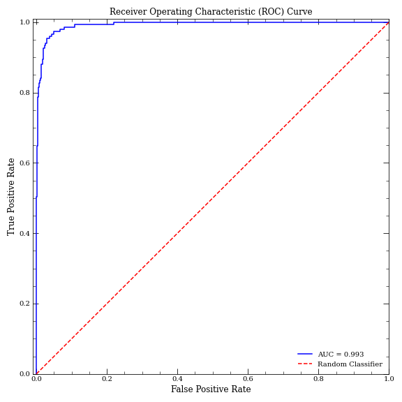

# Parkinsons_Random_Forest
Provided is a Random Forest classifier model for patients with Parkinson's Disease (https://www.kaggle.com/datasets/thedevastator/unlocking-clues-to-parkinson-s-disease-progressi), where the target feature is the Motor UPDRS score.

